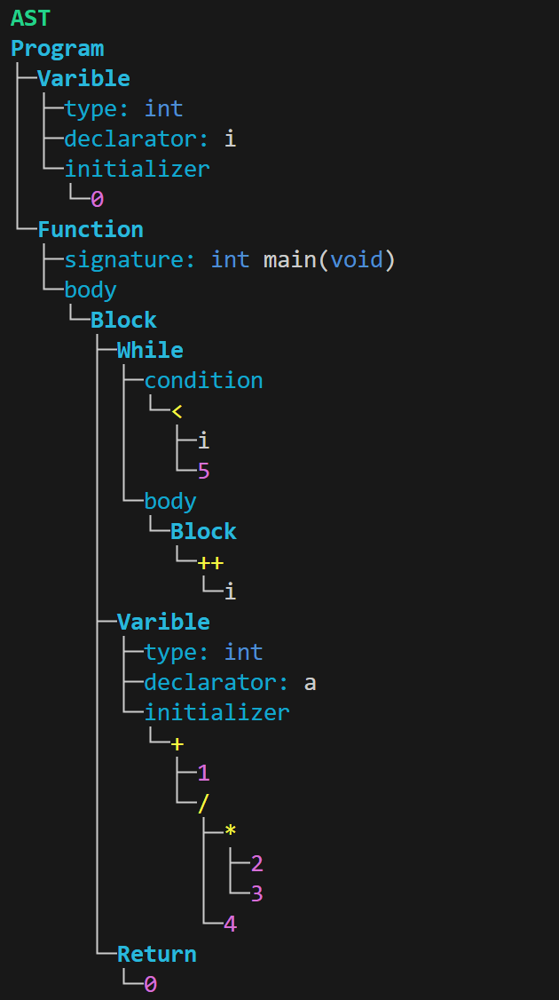

## 功能
将 C 语言代码转换成 AST 并打印出来.
## 运行方式
**编译:**
``` 
./1.sh
```
**运行测试代码:**
```
./gardenia "./test/1.c"
./gardenia --lex "./test/1.c"
```
> 加上选项 "--lex" 可以同时打印 tokens.
## 运行示例


## Features
Converts C language code into an AST and prints it out.

## How to Run
**Build**:
```
./1.sh
```
**Run the test code**:
```
./gardenia "./test/1.c"
./gardenia --lex "./test/1.c"
```
> Adding the "--lex" option will also print the tokens.